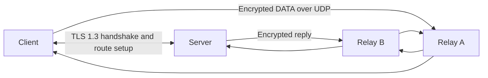

<p align="center">
  
</p>

<p align="center">
  <strong>An experimental C++20 overlay for ordinary IPv4 and IPv6 traffic.</strong>
</p>

<p align="center">
  
  
  
</p>

## What it is

S1lent establishes an authenticated control session, derives a unique data key, and carries encrypted packets across a configured sequence of UDP nodes. **Universal IP** is the routing model above S1lent; it is not a new IP protocol or address family.



## Current prototype

| Area | Included |
| --- | --- |
| Session setup | TLS 1.3 server verification, route validation, per-session key export |
| Data path | AES-256-GCM DATA packets, replay checks, UDP relay nodes |
| IP interface | Optional dynamically loaded Wintun adapter on Windows |
| Local checks | Unit tests, TLS handshake tests, bidirectional IPv4 path through two relay nodes |

## Build and verify

Requirements: Windows, CMake, a Visual Studio C++ workload, and OpenSSL 3 development files.

```powershell
cmake -S . -B build -DOPENSSL_ROOT_DIR="C:/path/to/openssl"
cmake --build build --config Release
ctest --test-dir build -C Release --output-on-failure
```

The integration executable binds loopback UDP ports and checks encrypted IPv4 packets in both directions. It uses fake IP interfaces and does not change Windows network settings.

## Local message demo

The sample route in `config/routes.example.conf` uses relay ports `9001` and `9002`, with the server listening on UDP port `9003` and TLS port `9004`.

Create a local certificate:

```powershell
openssl req -x509 -newkey rsa:2048 -nodes `
  -keyout build/tls-key.pem -out build/tls-cert.pem `
  -days 30 -subj '/CN=localhost' `
  -addext 'subjectAltName=DNS:localhost'
```

Run each command in a separate PowerShell window:

```powershell
.\build\Release\s1lent-server.exe .\config\routes.example.conf 127.0.0.1 9003 127.0.0.1 9004 .\build\tls-cert.pem .\build\tls-key.pem
```

```powershell
.\build\Release\s1lent-node.exe .\config\routes.example.conf 0 127.0.0.1 9001 node-a
```

```powershell
.\build\Release\s1lent-node.exe .\config\routes.example.conf 1 127.0.0.1 9002 node-b
```

Send a message from a fourth window:

```powershell
.\build\Release\s1lent-client.exe .\config\routes.example.conf 0.0.0.0 0 localhost 9004 .\build\tls-cert.pem auto 'hello S1lent'
```

The client prints `echo:hello S1lent`.

## Windows IP traffic

Put the official `wintun.dll` beside the executables, then start the client and server with `--tun S1lent`. Windows adapter addresses, routes, MTU, forwarding, and firewall rules must be configured for the host separately.

The current S1lent packet limit is **1156 bytes per IP packet**. Fragmentation is not implemented, and end-to-end OS traffic through a configured Wintun adapter has not yet been validated.

<br>

<div align="center">
  <sub>Experimental software · No throughput or latency claims</sub>
</div>
